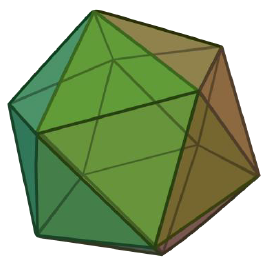
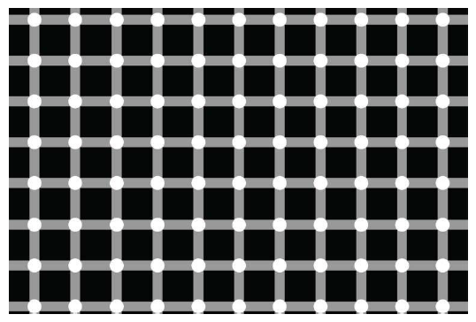

# [THIRD PROJECT] Computer Graphics

## Summary  
The objective of this project was to evaluate our knowledge in different types of lights and materials, tilings, and solid creation using polygons.  
We were asked to create a scene with a irregular icosahedron and a board with a specific pattern  
 &ensp; &ensp;   
&ensp; &ensp; &ensp; Regular icosahedron &ensp; &ensp; &ensp; &ensp; &ensp; &ensp; &ensp; &ensp; &ensp; &ensp; &ensp; &ensp; Board pattern  
   
   
* Scene should be illuminated by a global directional light. Should be turned on/off by using **Q** key
* Objects should have three different types of materials: Basic, Lambert and Phong. 
* Using **W** key should turn on/off light calculations (change material between Basic and non-Basic). 
* Using **E** key should change the type of shadowing Gourand/Phong (change material between Lambert and Phong - when material is non-Basic)  
* Scene should have four spotlights. They can be turned on/off by using **1** to **4** keys  
* We should see all scene with perspective camera using key **5**, and see only the board with a orthogonal camera using key **6** 

---
  
You can check https://ist-cg-p3.netlify.com where our project is deployed  

## Check  for more detailed info (in portuguese)

## Authors 
| Name | University | More info |
| ---- | ---- | ---- |
| Afonso Matos | Instituto Superior Técnico |    |
| Ricardo Fernandes | Instituto Superior Técnico |    |
| Tomás Lopes | Instituto Superior Técnico |    |
